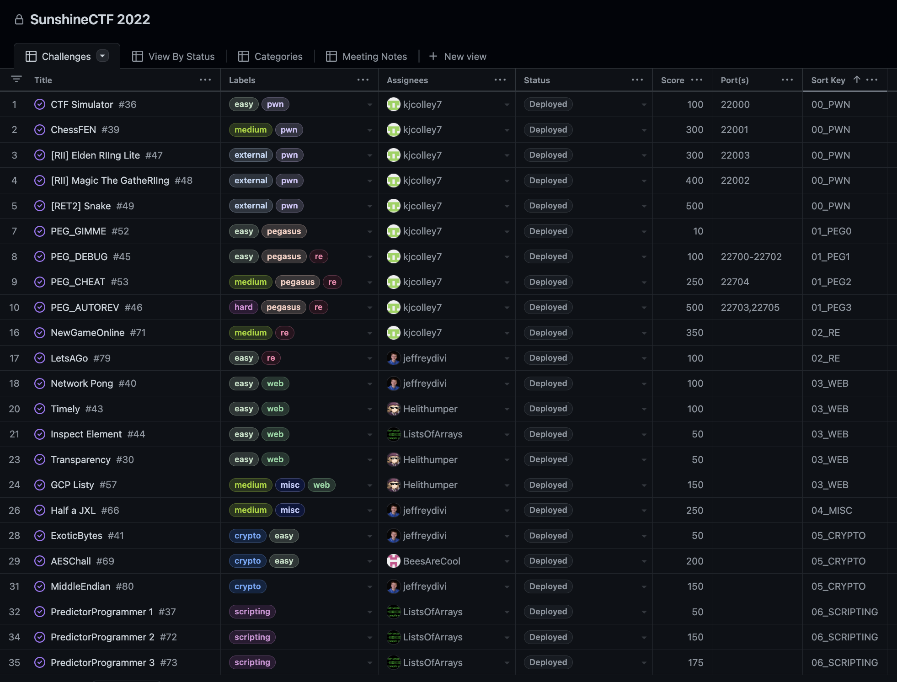

SunshineCTF 2022 Challenges
-----

This is the public release of the challenges from SunshineCTF 2022. Unless otherwise specified, all challenges are released under the MIT license.

### How to build/deploy Reversing and Pwn challenges

Install the `pwnmake` command by following the instructions located at https://github.com/C0deH4cker/PwnableHarness.

* To compile all binaries: `pwnmake`
* To build Docker images for all server-based challenges: `pwnmake docker-build`
* To run Docker containers for all server-based challenges: `pwnmake docker-start`
* To publish all build artifacts that should be distributed to players to the `publish` folder: `pwnmake publish`

### Challenge planning and organization

For a bit of a peek inside our challenge organization, we used GitHub Projects this year to keep track of
our challenges. It ended up being an excellent way to see at a glance how many challenges in each category
we had, the difficulty levels of them, the development/testing status of each, and the port numbers assigned
to each challenge. This screenshot only shows the challenges that actually made it to being used in the CTF.

Most of the server-based challenges will be migrated to https://ctf.hackucf.org eventually.
